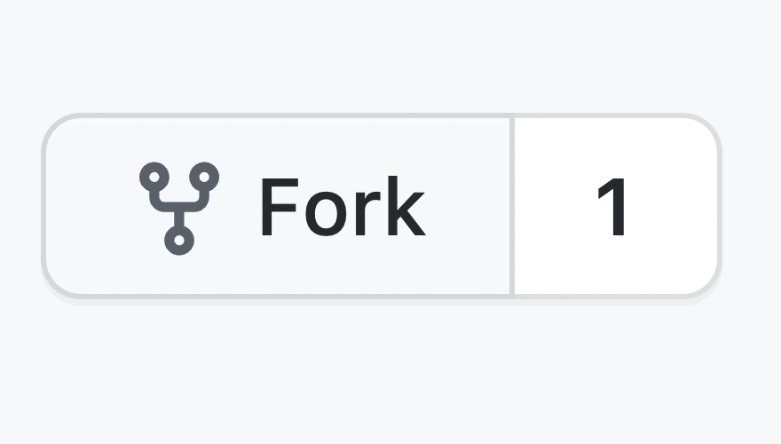
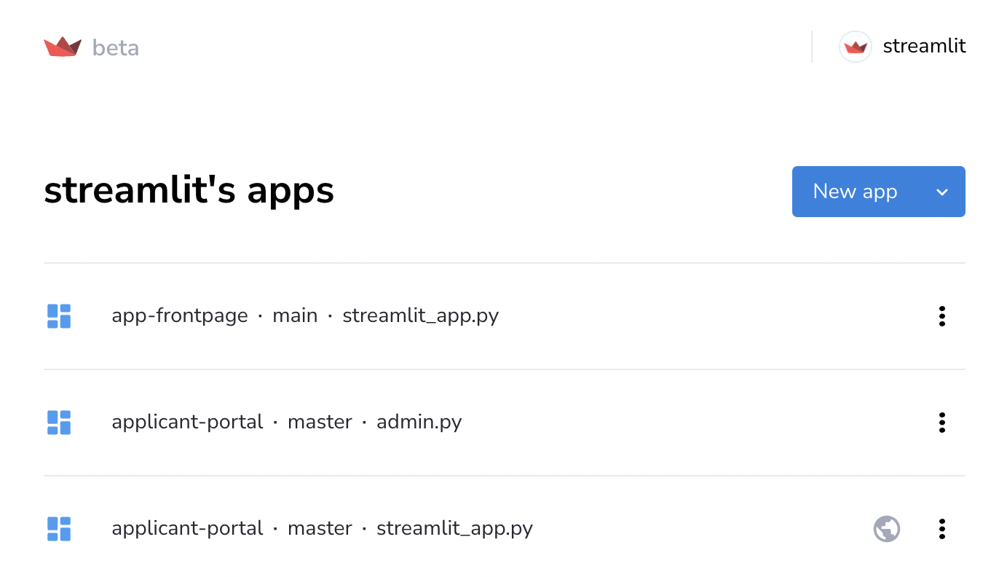
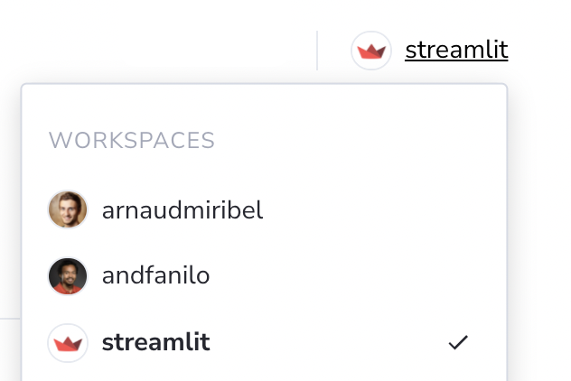
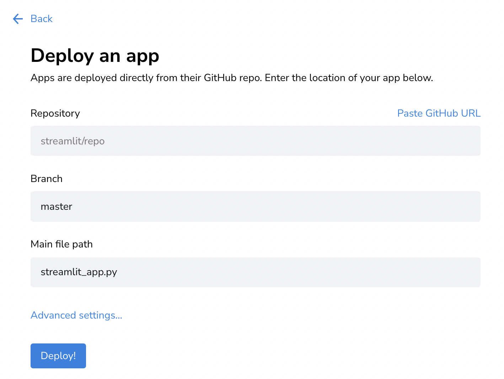
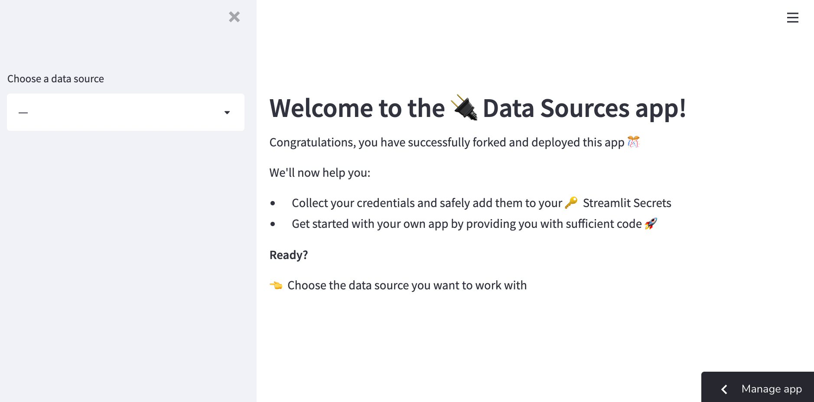

# Streamlit demo: 🔌 The Data Sources app

Streamlit makes it **super easy** to connect your apps to your data sources. With this app, we'll show you the way!

## Get started!

**Deploy this app** in your own workspace in Streamlit Cloud 🎈

<table border="0">
   <tr>
     <td></td>
     <td>Start by <a href="https://github.com/streamlit/data_sources_app/fork">forking</a> this app's repository.
   </tr>
   <tr>
      <td></td>
      <td>Now, visit your <a href="https://share.streamlit.io/signup">Streamlit Cloud dashboard</a> and click on <kbd>New App</kbd></td>
   </tr>
   <tr>
      <td></td>
      <td>Make sure that you have chosen the right Streamlit workspace. If you haven't, simply click on your current workspace in the upper right corner of the dashboard, and choose the one you want to deploy with!  </td>
   </tr>
   <tr>
      <td></td>
      <td>
         You can fill the form with: 
         <ul>
            <li>your repository name (<code>{username}/data_sources_app</code>)</li>
            <li>the branch name (<code>main</code>)</li>
            <li>the main file path (<code>streamlit_app.py</code>)</li>
         </ul>
      </td>
   </tr>
   <tr>
      <td></td>
      <td>Finally, click on <kbd> Deploy! </kbd> and watch your app launch. It can take a minute or two!</td>
   </tr>
   <tr>
      <td></td>
      <td>🎊 Congrats, you're done with this part: your app is running on Streamlit Cloud! <b>Now stay on your app, choose a data source</b> and follow the instructions there! </td>
   </tr>
</table>

### Questions? Comments?

Please ask in the [Streamlit community](https://discuss.streamlit.io).
